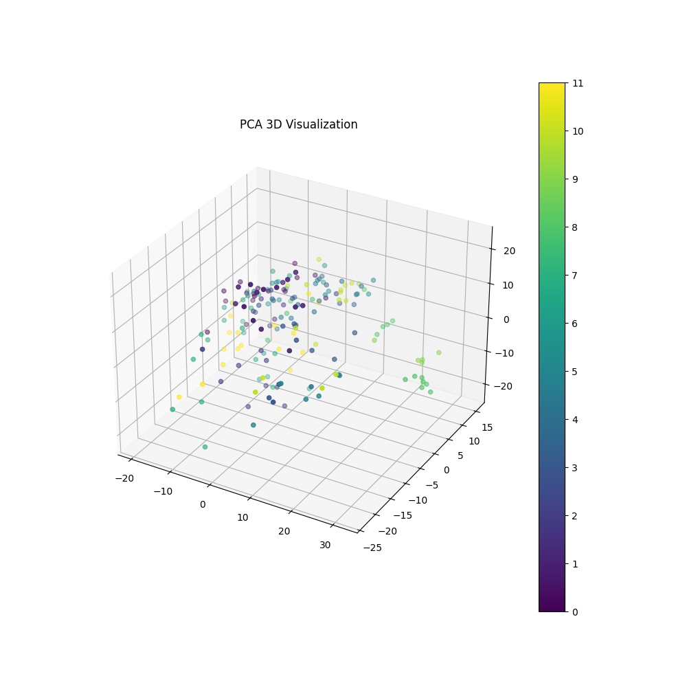
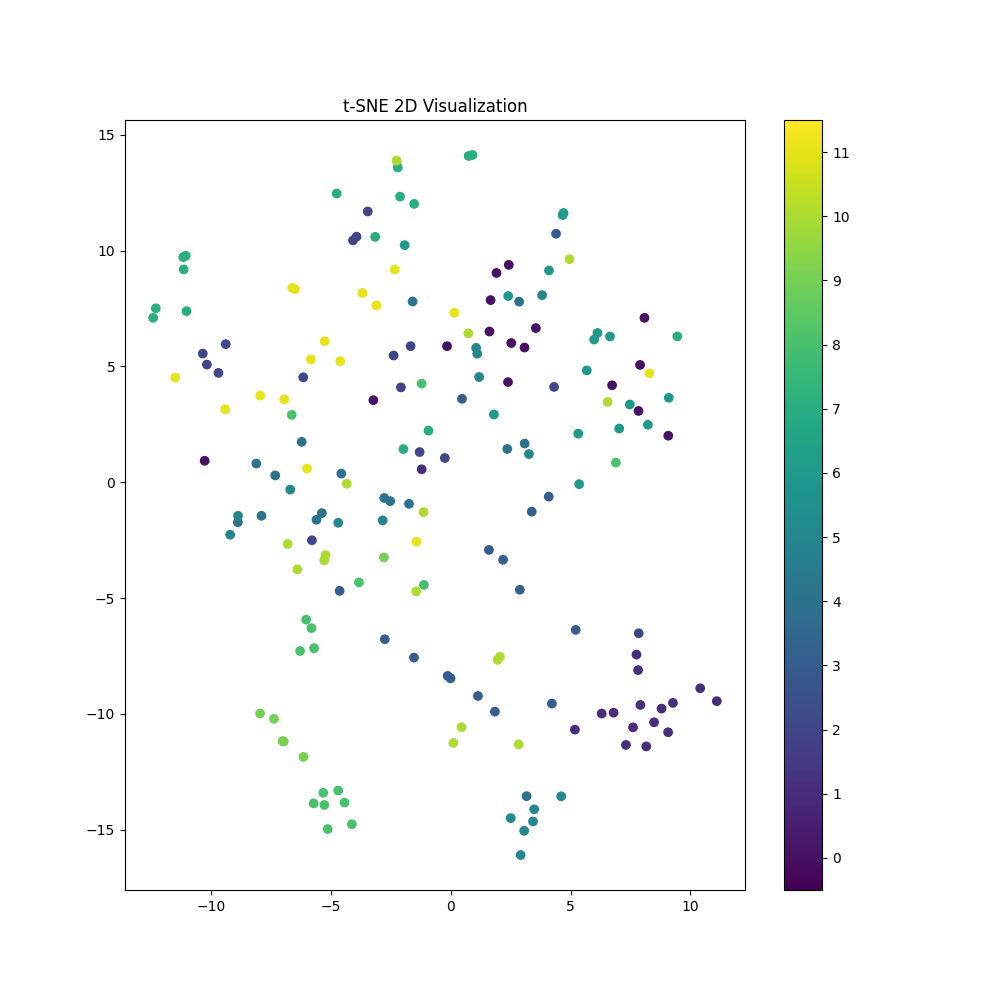
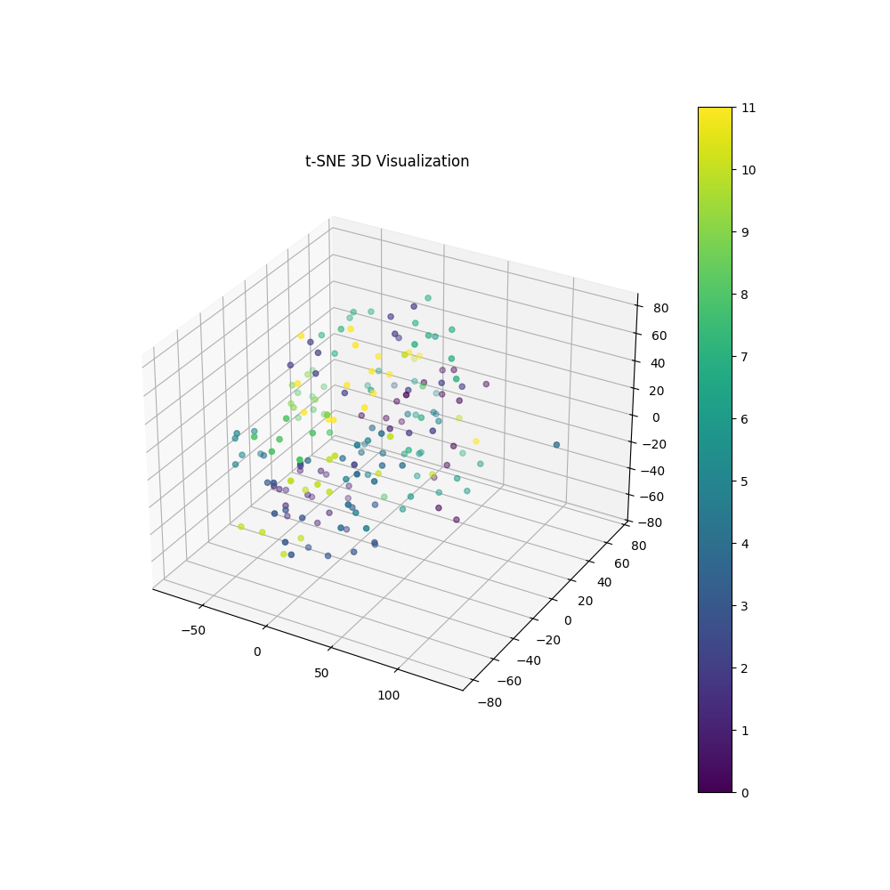
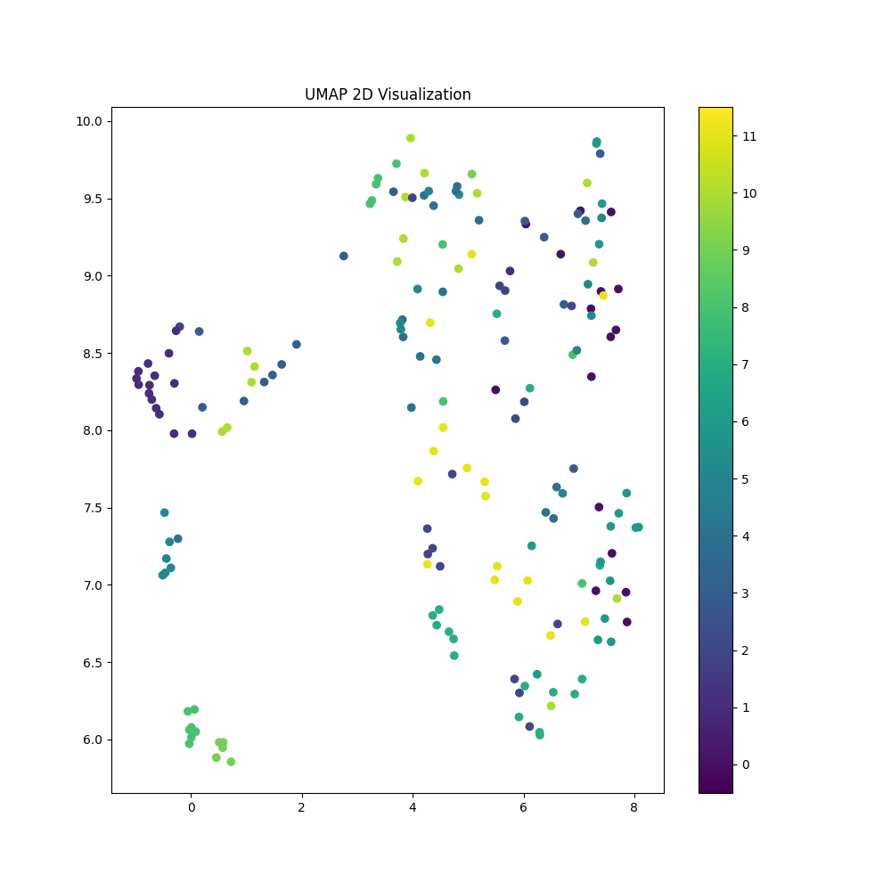
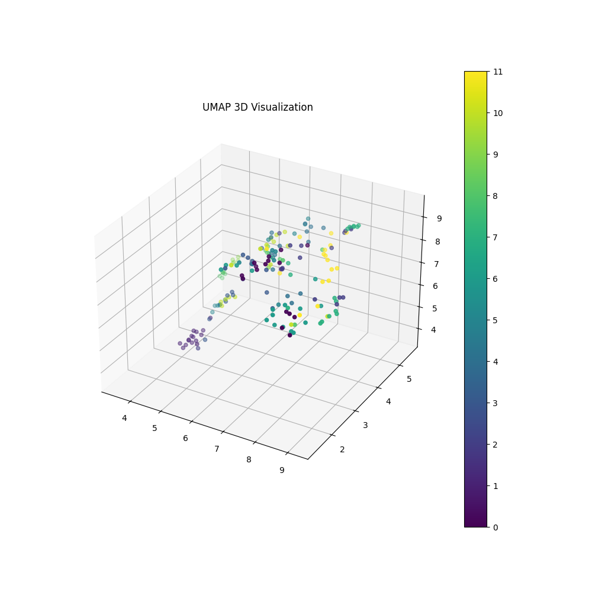
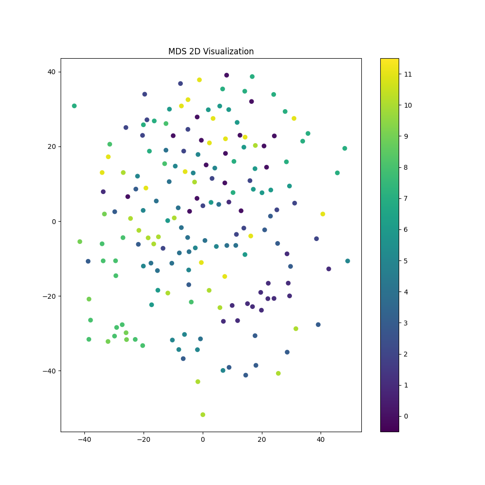
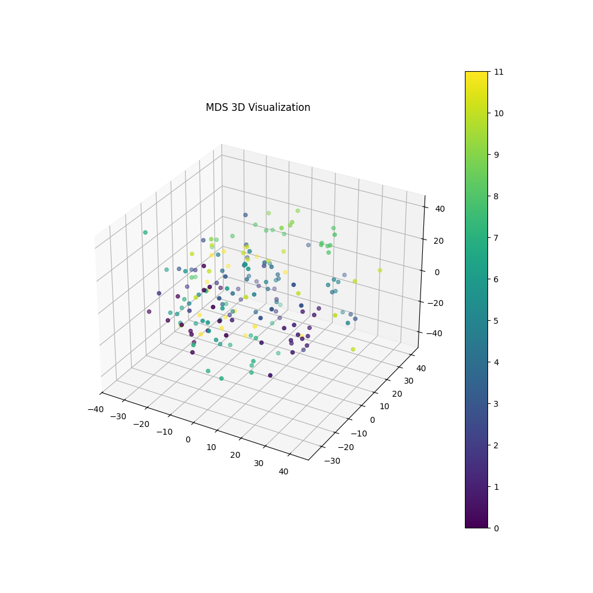
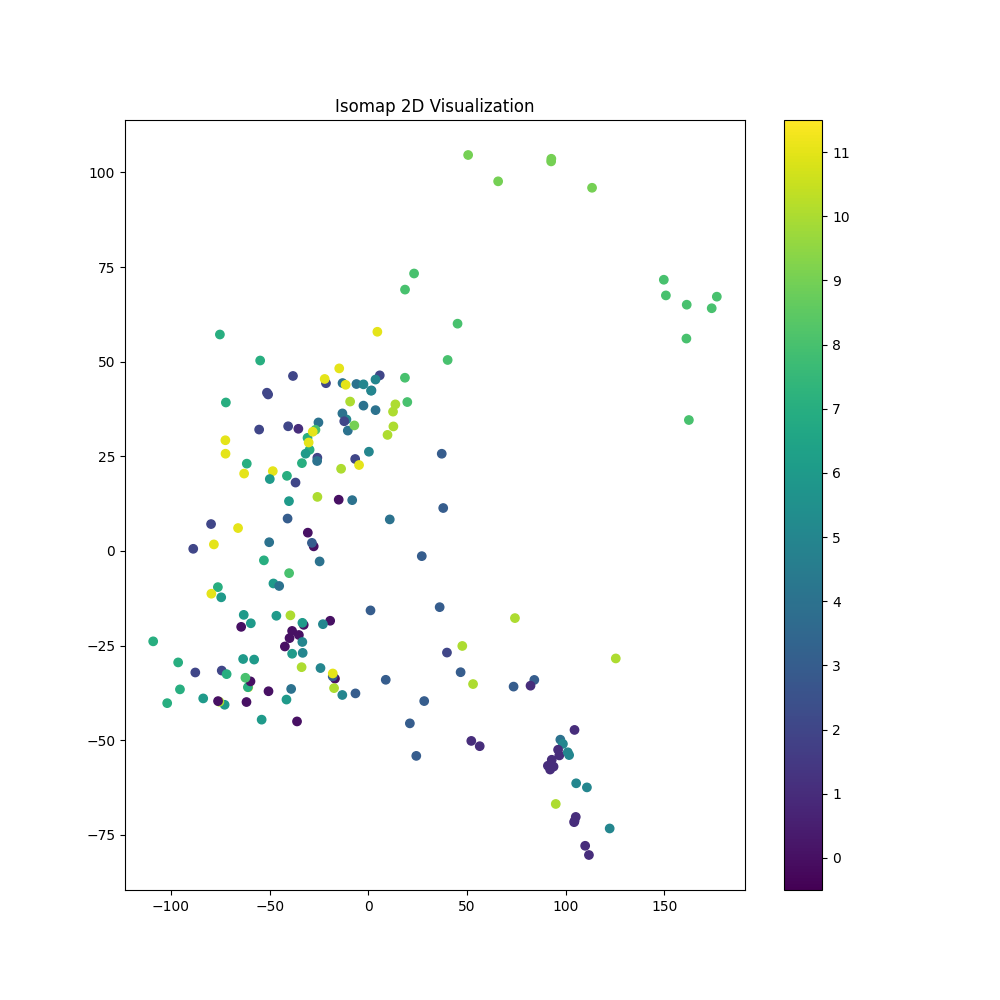
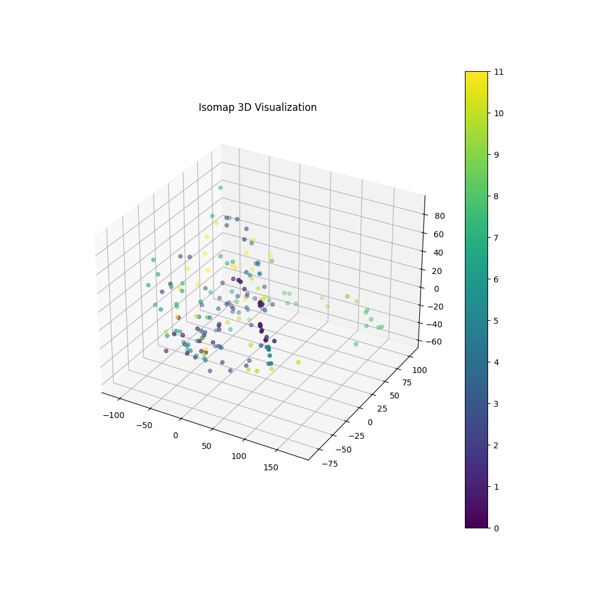

## PCA, t-SNE, UMAP, MDS, Isomap의 다섯 가지 방법을 통해 차원 축소된 임베딩 벡터를 시각화

### 실행 방법

1. Weaviate 서버 실행:
    ```sh
    cd ImageImbedding/Issue2_openDB
    docker-compose up -d
    ```

2. 데이터베이스 초기화:
    ```sh
    python initializeDB.py
    ```

3. 이미지 임베딩 저장:
    ```sh
    python weaviateStore.py
    ```

4. `ImageImbedding/Issue4_PCA` 폴더로 이동하여 임베딩 벡터 시각화:
    ```sh
    cd ../Issue4_PCA
    python weaviate_visualize.py
    ```

이제 `weaviate_visualize.py`를 실행하면 PCA, t-SNE, UMAP, MDS, Isomap을 사용하여 차원 축소된 임베딩 벡터를 각각 시각화할 수 있습니다.


 
 
 
 
 