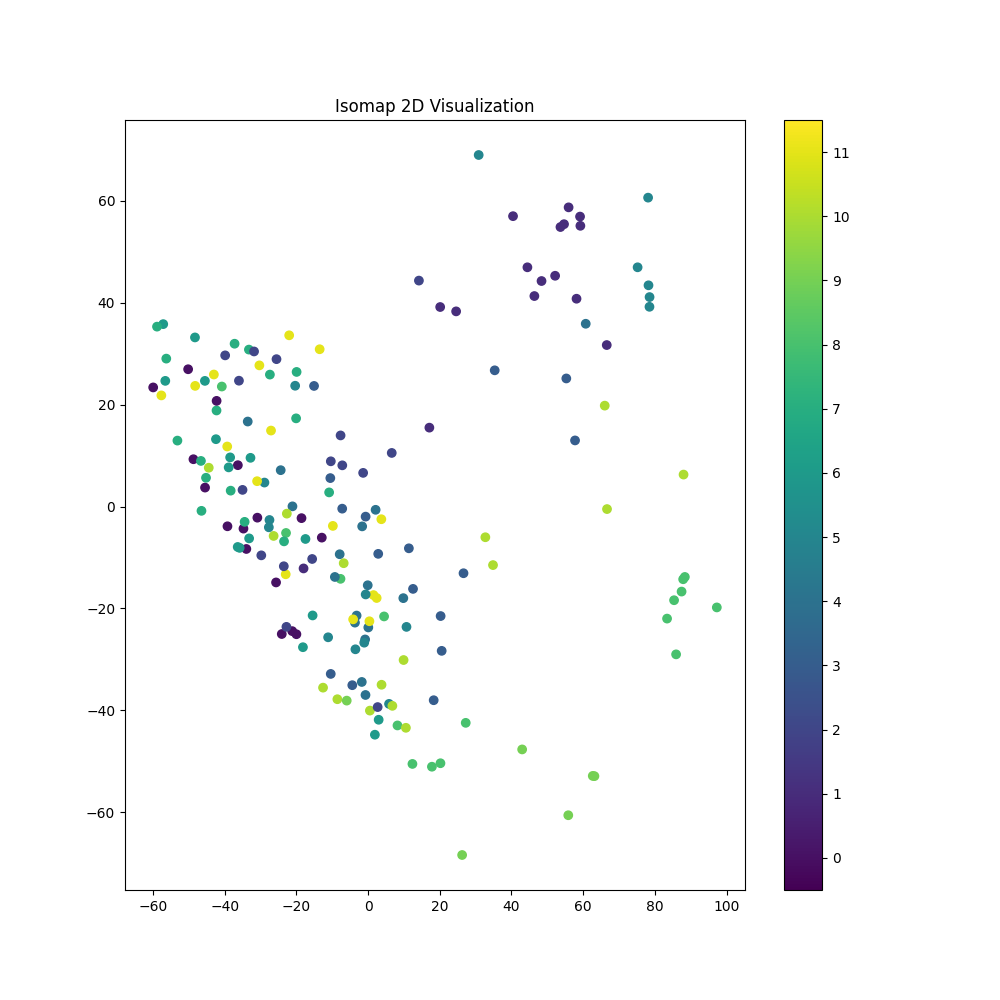
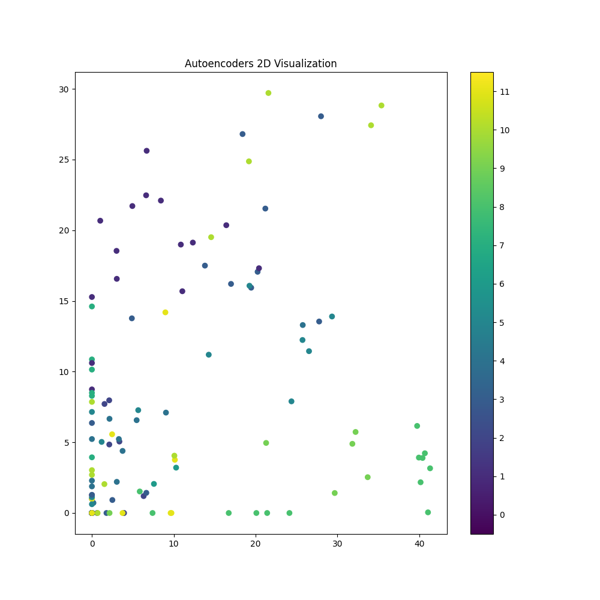

## PCA, t-SNE, UMAP, MDS, Isomap, LDA, Autoencoders, Factor Analysis, Kernel PCA의 아홉 가지 방법을 통해 차원 축소된 임베딩 벡터를 시각화

## 디렉토리 구조
```
Issue4_PCA/
├── dimension_reduction.py
├── weaviate_visualize.py
├── generate_tsv.py
├── embeddings_metadata.tsv
├── embeddings_tensor.tsv
├── adjParam.ipynb
└── README.md
```

### 실행 방법

1. Weaviate 서버 실행:
    ```sh
    cd ImageImbedding/Issue2_openDB
    docker-compose up -d
    ```

2. 데이터베이스 초기화:
    ```sh
    python initializeDB.py
    ```

3. 이미지 임베딩 저장:
    ```sh
    python weaviateStore.py
    ```

4. `ImageImbedding/Issue4_PCA` 폴더로 이동하여 임베딩 벡터 시각화:
    ```sh
    cd ../Issue4_PCA
    python weaviate_visualize.py
    ```

이제 `weaviate_visualize.py`를 실행하면 PCA, t-SNE, UMAP, MDS, Isomap, LDA, Autoencoders, Factor Analysis, Kernel PCA를 사용하여 차원 축소된 임베딩 벡터를 각각 시각화할 수 있습니다.


### 실행 결과

 
PCA 2D reduction time: 0.0073 seconds  ||
PCA 3D reduction time: 0.0081 seconds

 
t-SNE 2D reduction time: 0.4822 seconds  ||
t-SNE 3D reduction time: 0.8494 seconds

 
UMAP 2D reduction time: 7.7850 seconds  ||
UMAP 3D reduction time: 1.1920 seconds

 
MDS 2D reduction time: 0.7876 seconds  ||
MDS 3D reduction time: 0.6716 seconds

 
Isomap 2D reduction time: 0.0735 seconds  ||
Isomap 3D reduction time: 0.0314 seconds

 
LDA 2D reduction time: 0.0528 seconds  || 
LDA 3D reduction time: 0.0490 seconds

 
Autoencoders 2D reduction time: 2.8612 seconds  || 
Autoencoders 3D reduction time: 2.5404 seconds

 
Factor Analysis 2D reduction time: 0.0400 seconds  ||
Factor Analysis 3D reduction time: 0.0252 seconds

 
Kernel PCA 2D reduction time: 0.0091 seconds  || 
Factor Analysis 3D reduction time: 0.0252 seconds


### Embedding Projector - 구글 지원 데이터 시각화 도구
 https://projector.tensorflow.org/ (아래의 파일 load하여 확인)

    ```sh
    python generate_tsv.py
    ```

    ```sh
    embeddings_tensor.tsv
    embeddings_metadata.tsv
    ```

## 파일 설명

### dimension_reduction.py

다양한 차원 축소 기법(PCA, t-SNE, UMAP, MDS, Isomap, LDA, Autoencoders, Factor Analysis, Kernel PCA)을 사용하여 고차원 임베딩 벡터를 2D 또는 3D로 축소하는 기능을 제공하는 스크립트.

### weaviate_visualize.py

Weaviate에서 임베딩 벡터를 가져와 차원 축소 및 시각화를 수행하며, 각 차원 축소 기법의 실행 시간을 측정하는 스크립트.

### generate_tsv.py

임베딩 벡터와 그 메타데이터를 TSV(Tab-Separated Values) 파일로 생성하는 스크립트.

### embeddings_metadata.tsv

각 임베딩 벡터에 대한 메타데이터(예: 이미지 경로와 레이블)를 저장한 TSV 파일.

### embeddings_tensor.tsv

임베딩 벡터를 저장한 TSV 파일. 각 행이 하나의 벡터를 나타냄.

### adjParam.ipynb

파라미터 조정이 가능한 기법들의 최적 파라미터 찾기 위한 결과 비교