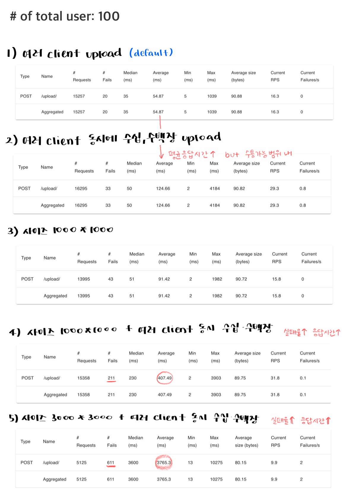

# 이미지 업로드 및 임베딩 서비스

이 프로젝트는 이미지를 업로드(PostgreSQL)하고, 이미지를 Kafka를 통해 전달하며, 임베딩을 생성하고 Weaviate에 저장하는 기능을 제공합니다.

## 프로젝트 구조
```lua
/Issue9
|-- docker-compose.yml
|-- requirements.txt
|-- image-service/
|   |-- Dockerfile
|   |-- main.py
|   |-- requirements.txt
|-- embedding-worker-1/
|   |-- Dockerfile
|   |-- embedding_service.py
|   |-- requirements.txt
|-- locust/
|   |-- Dockerfile
|   |-- locustfile.py
|-- upload_test.py
|-- README.md
```

## 설치 및 실행

### 1. Docker Compose 설정
`docker-compose.yml` 파일은 각 서비스 (PostgreSQL, Kafka, FastAPI 등)를 설정합니다. 각 서비스가 네트워크 `app_net`을 통해 서로 통신할 수 있도록 설정되어 있습니다.

### 2. 이미지 서비스 (image-service)
FastAPI를 사용하여 이미지를 업로드하고, 이미지 메타데이터를 PostgreSQL에 저장하며, Kafka를 통해 UUID를 전달합니다.

#### 주요 코드
- **image-service/Dockerfile**: FastAPI 애플리케이션을 위한 Docker 이미지를 빌드합니다.
- **image-service/main.py**: FastAPI 엔드포인트를 정의하고, 이미지를 저장하며, 메타데이터를 PostgreSQL에 저장하고, Kafka에 메시지를 보냅니다.

### 3. 임베딩 서비스 (embedding-service)
Kafka에서 메시지를 소비하고, 이미지를 임베딩하여 Weaviate에 저장합니다.

#### 주요 코드
- **embedding-worker-1/Dockerfile**: 임베딩 서비스 애플리케이션을 위한 Docker 이미지를 빌드합니다.
- **embedding-worker-1/embedding_service.py**: Kafka에서 이미지를 소비하고, 임베딩을 생성하여 Weaviate에 저장합니다.
- **embedding-worker-2/Dockerfile**: 임베딩 서비스 애플리케이션을 위한 Docker 이미지를 빌드합니다.
- **embedding-worker-2/embedding_service.py**: Kafka에서 이미지를 소비하고, 임베딩을 생성하여 Weaviate에 저장합니다.

### 4. Locust를 이용한 부하 테스트 (locust)
Locust를 사용하여 이미지 업로드 및 유사 이미지 검색 API의 부하 테스트를 수행합니다.

#### 주요 코드
- **locust/Dockerfile**: Locust 애플리케이션을 위한 Docker 이미지를 빌드합니다.
- **locust/locustfile.py**: Locust 스크립트로, 이미지 업로드 및 유사 이미지 검색 작업을 정의합니다.

### 5. 테스트 스크립트 (upload_test.py)
test 이미지 dataset 업로드를 위한 스크립트입니다.


## 실행 방법
프로젝트 루트 디렉토리에서 다음 명령어를 실행하여 Docker Compose로 모든 서비스를 시작합니다:
```sh
docker-compose up --build
```

### 1. Swagger UI 접속 및 이미지 업로드 테스트
브라우저에서 `http://localhost:5001/docs`로 접속하여 `/upload/` 엔드포인트를 사용하여 이미지를 업로드합니다.

### 2. Kafka UI에서 메시지 확인
브라우저에서 `http://localhost:8081`로 접속하여 `image_topic`에 메시지가 들어왔는지 확인합니다.

### 3. Weaviate에서 임베딩 데이터 확인
브라우저에서 `http://localhost:8080/v1/objects`로 접속하여 저장된 이미지 임베딩 데이터를 확인합니다.

### 4. Locust를 이용한 부하 테스트 실행
브라우저에서 `http://localhost:8089`로 접속하여 Locust 부하 테스트를 시작합니다.

### (필요 시) 테스트 스크립트 실행
다음 명령어를 실행하여 `upload_test.py` 스크립트를 실행합니다:
```sh
python3 /path/to/upload_test.py
```


## locust 결과 정리

### 1. upload test
```
Issue9/locustResult/uploadImg.html
```

### 2. similar search test (303개 저장된 상태에서 검색) 
```
Issue9/locustResult/searchSim.html
```

### 3.  여러 client가 동시에 수십 수백장을 업로드 요청 테스트
```
Issue9/locustResult/multiUpload.html
```

### 4. 이미지 사이즈 1000 * 1000
```
Issue9/locustResult/imgSize10.html
```

### 4-1. 이미지 사이즈 1000 * 1000 + 한번에 수십, 수백장 업로드
```
Issue9/locustResult/imgSize10_multi.html
```

### 5. 이미지 사이즈 3000 * 3000 + 한번에 수십, 수백장 업로드
```
Issue9/locustResult/imgSize30_multi.html
```

